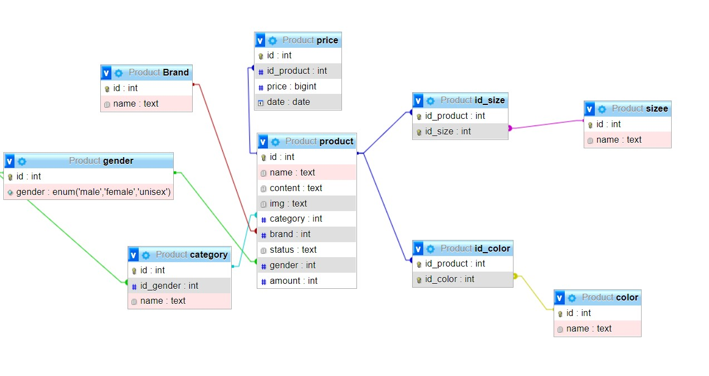
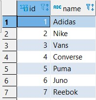
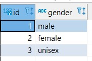
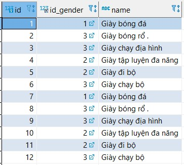
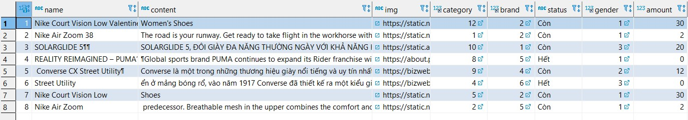
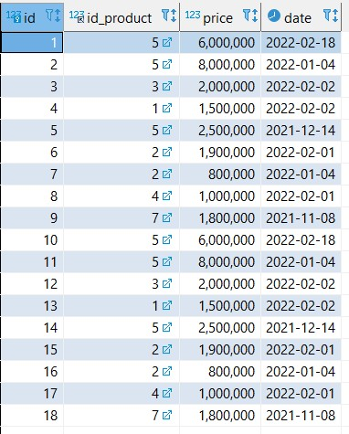
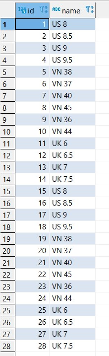
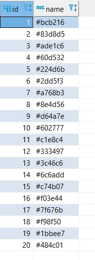
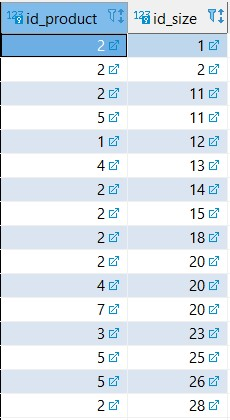
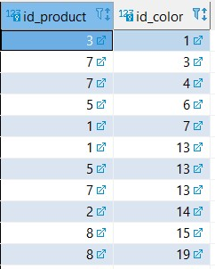

# Shoe

```sql
CREATE TABLE Brand (
id INT PRIMARY KEY AUTO_INCREMENT,
name TEXT NOT NULL
)
```

```sql
CREATE TABLE gender(
id INT PRIMARY KEY AUTO_INCREMENT ,
gender ENUM('male','female','unisex')
)
```

```sql
CREATE TABLE  category(
id INT PRIMARY KEY AUTO_INCREMENT ,
id_gender INT ,
name TEXT NOT NULL,

FOREIGN KEY (id_gender) REFERENCES gender (id)
)
```

```sql
CREATE TABLE product(
id INT PRIMARY KEY AUTO_INCREMENT ,
name TEXT NOT NULL,
content TEXT NOT NULL,
img TEXT NOT NULL,
category INT NOT NULL,
brand INT NOT NULL,
status TEXT NOT NULL,
gender INT NOT NULL,
amount INT NOT NULL,

FOREIGN KEY (gender) REFERENCES gender (id),
FOREIGN KEY (category) REFERENCES category (id),
FOREIGN KEY (Brand) REFERENCES Brand  (id)
)
```

```sql
CREATE TABLE price(
id INT PRIMARY KEY AUTO_INCREMENT ,
id_product INT ,
price BIGINT NOT NULL,
date DATE NOT NULL,

FOREIGN KEY (id_product) REFERENCES product (id)
)
```

```sql
CREATE TABLE sizee(
id INT PRIMARY KEY AUTO_INCREMENT,
name TEXT NOT NULL
)
```

```sql
CREATE TABLE color(
id INT PRIMARY KEY AUTO_INCREMENT ,
name TEXT NOT NULL
)
```

```sql
CREATE TABLE id_size(
id_product INT,
id_size INT,
PRIMARY KEY (id_product,id_size),
FOREIGN KEY (id_product) REFERENCES product (id),
FOREIGN KEY (id_size) REFERENCES sizee (id)
)

```

```sql
CREATE TABLE id_color(
id_product INT,
id_color INT,
PRIMARY KEY (id_product,id_color),
FOREIGN KEY (id_product) REFERENCES product (id),
FOREIGN KEY (id_color) REFERENCES color (id)
)

```



# chèn database

`brand`

  
 `gender`

  
`category`

  
`product`

  
`price`

  
`size`

  
`color`

  
`id_size`

  
`id_color`


